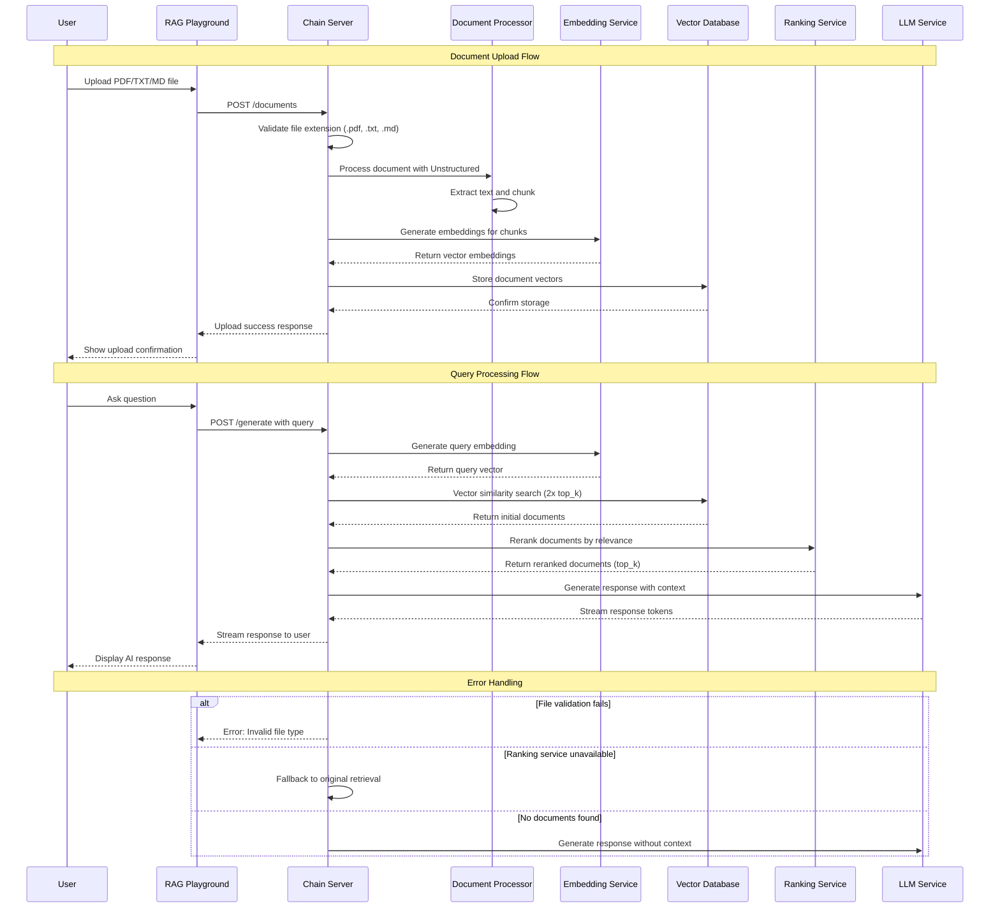
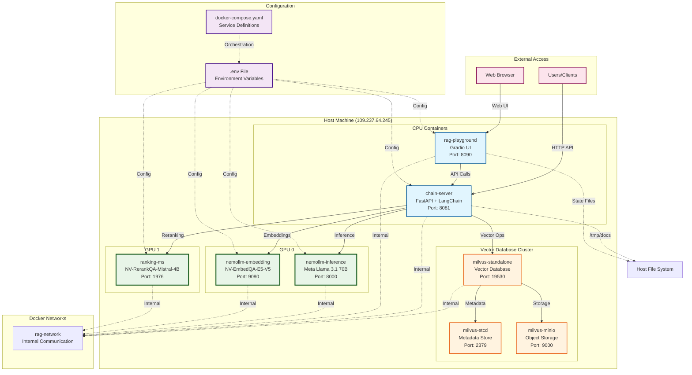

# RAG System Architecture Documentation

## Overview

This document provides a comprehensive overview of the RAG (Retrieval-Augmented Generation) system architecture, including all components, data flows, and deployment configurations.

## System Architecture

### High-Level Architecture

```mermaid
graph TB
    %% User Interface Layer
    subgraph "User Interface Layer"
        UI[RAG Playground<br/>Gradio UI<br/>:8090]
        API[REST API Client]
    end

    %% Application Layer
    subgraph "Application Layer"
        CS[Chain Server<br/>FastAPI<br/>:8081]
        subgraph "Chain Components"
            RAG[RAG Chain<br/>LangChain]
            DOC[Document Processor<br/>Unstructured]
            VALID[File Validator<br/>(.pdf, .txt, .md)]
        end
    end

    %% AI Services Layer
    subgraph "AI Services Layer (NVIDIA NIMs)"
        LLM[LLM Service<br/>Meta Llama 3.1 70B<br/>:8000<br/>GPU 0]
        EMB[Embedding Service<br/>NV-EmbedQA-E5-V5<br/>:9080<br/>GPU 0]
        RANK[Ranking Service<br/>NV-RerankQA-Mistral-4B<br/>:1976<br/>GPU 1]
    end

    %% Data Layer
    subgraph "Data Storage Layer"
        MILVUS[Milvus Vector DB<br/>:19530]
        ETCD[etcd<br/>:2379]
        MINIO[MinIO<br/>:9000]
    end

    %% File Storage
    subgraph "File System"
        DOCS[Document Storage<br/>/tmp/docs]
        STATE[State Files<br/>uploaded_files.txt]
    end

    %% User Interactions
    UI -->|File Upload<br/>Chat Queries| CS
    API -->|HTTP Requests| CS

    %% Chain Server Processing
    CS -->|1. Validate Files| VALID
    CS -->|2. Process Documents| DOC
    CS -->|3. Generate Embeddings| EMB
    CS -->|4. Store Vectors| MILVUS
    CS -->|5. Execute RAG Chain| RAG

    %% RAG Chain Flow
    RAG -->|Query Embedding| EMB
    RAG -->|Vector Search| MILVUS
    RAG -->|Rerank Results| RANK
    RAG -->|Generate Response| LLM

    %% Document Processing Flow
    VALID -->|Valid Files| DOCS
    DOC -->|Extract Text| DOCS
    DOC -->|Chunk Documents| EMB

    %% Vector Database Dependencies
    MILVUS -->|Metadata Storage| ETCD
    MILVUS -->|Object Storage| MINIO

    %% File State Management
    CS -->|Track Uploads| STATE

    %% Styling
    classDef userLayer fill:#e1f5fe,stroke:#01579b,stroke-width:2px
    classDef appLayer fill:#f3e5f5,stroke:#4a148c,stroke-width:2px
    classDef aiLayer fill:#e8f5e8,stroke:#1b5e20,stroke-width:2px
    classDef dataLayer fill:#fff3e0,stroke:#e65100,stroke-width:2px
    classDef fileLayer fill:#fce4ec,stroke:#880e4f,stroke-width:2px

    class UI,API userLayer
    class CS,RAG,DOC,VALID appLayer
    class LLM,EMB,RANK aiLayer
    class MILVUS,ETCD,MINIO dataLayer
    class DOCS,STATE fileLayer
```

## Data Flow Diagrams

### Document Upload & Query Processing Flow



## Component Details

### 1. User Interface Layer
- **RAG Playground**: Gradio-based web interface for file uploads and chat interactions
- **REST API**: Direct API access for programmatic integration

### 2. Application Layer
- **Chain Server**: FastAPI-based orchestration service
- **RAG Chain**: LangChain implementation for retrieval-augmented generation
- **Document Processor**: Unstructured library for text extraction
- **File Validator**: Case-insensitive validation for .pdf, .txt, .md files

### 3. AI Services Layer (NVIDIA NIMs)
- **LLM Service**: Meta Llama 3.1 70B for text generation
- **Embedding Service**: NV-EmbedQA-E5-V5 for vector embeddings
- **Ranking Service**: NV-RerankQA-Mistral-4B for document reranking

### 4. Data Storage Layer
- **Milvus**: Vector database for similarity search
- **etcd**: Metadata storage for Milvus
- **MinIO**: Object storage for Milvus

### 5. File System
- **Document Storage**: Temporary storage for uploaded files
- **State Files**: Tracking of uploaded documents

## Key Features

### ✅ Enhanced Retrieval with Reranking
1. **Initial Retrieval**: Fetch 2x the requested documents from vector store
2. **Reranking**: Use NVIDIA ranking model to improve relevance
3. **Selection**: Return top-k most relevant documents
4. **Fallback**: Graceful degradation if ranking service unavailable

### ✅ Robust File Processing
- Case-insensitive file extension validation
- Support for PDF, TXT, and MD formats
- Comprehensive error handling and logging
- Dependency conflict resolution

### ✅ GPU Optimization
- **GPU 0**: LLM and Embedding services (shared)
- **GPU 1**: Ranking service (dedicated)
- Optimal resource distribution for performance

## Configuration

### Environment Variables (.env)
```bash
# LLM Configuration
APP_LLM_MODELNAME=meta/llama-3.1-70b-instruct
APP_LLM_MODELENGINE=nvidia-ai-endpoints
APP_LLM_SERVERURL=http://nemollm-inference:8000/v1

# Embedding Configuration
APP_EMBEDDINGS_MODELNAME=nvidia/nv-embedqa-e5-v5
APP_EMBEDDINGS_MODELENGINE=nvidia-ai-endpoints
APP_EMBEDDINGS_SERVERURL=http://nemollm-embedding:8000/v1

# Ranking Configuration
APP_RANKING_MODELNAME=nv-rerank-qa-mistral-4b:1
APP_RANKING_MODELENGINE=nvidia-ai-endpoints
APP_RANKING_SERVERURL=http://ranking-ms:8000/v1

# GPU Assignments
LLM_MS_GPU_ID=0
EMBEDDING_MS_GPU_ID=0
RANKING_MS_GPU_ID=1
```

## API Endpoints

### Chain Server (Port 8081)
- `POST /documents` - Upload documents to knowledge base
- `POST /generate` - Generate responses with RAG
- `GET /docs` - API documentation

### RAG Playground (Port 8090)
- Web interface for file uploads and chat
- Knowledge base management
- Real-time chat with document context

## Deployment Architecture

### Container Deployment Overview



### Deployment Summary

The system is deployed using Docker Compose with the following services:

| Service | Container Name | Port | GPU | Purpose |
|---------|---------------|------|-----|---------|
| **Chain Server** | chain-server | 8081 | - | FastAPI orchestration service |
| **RAG Playground** | rag-playground | 8090 | - | Gradio web interface |
| **LLM Service** | nemollm-inference | 8000 | GPU 0 | Meta Llama 3.1 70B inference |
| **Embedding Service** | nemollm-embedding | 9080 | GPU 0 | NV-EmbedQA-E5-V5 embeddings |
| **Ranking Service** | ranking-ms | 1976 | GPU 1 | NV-RerankQA-Mistral-4B reranking |
| **Vector Database** | milvus-standalone | 19530 | - | Vector similarity search |
| **Metadata Store** | milvus-etcd | 2379 | - | Milvus metadata |
| **Object Storage** | milvus-minio | 9000 | - | Milvus object storage |

**Total: 8 containers**
- **3 GPU-accelerated AI services** (distributed across 2 GPUs)
- **1 vector database cluster** (3 containers: Milvus, etcd, MinIO)
- **2 application services** (Chain Server, RAG Playground)
- **Automatic service discovery and networking**

## Performance Characteristics

- **Concurrent Users**: Supports multiple simultaneous users
- **Document Processing**: Handles PDF, TXT, MD files up to reasonable sizes
- **Response Time**: Sub-second for cached queries, 2-5 seconds for complex queries
- **Scalability**: Horizontally scalable with additional GPU resources
- **Reliability**: Automatic fallback mechanisms for service failures

## Security Considerations

- Internal Docker network isolation
- No external database access
- File validation and sanitization
- Temporary file cleanup
- Service health monitoring
